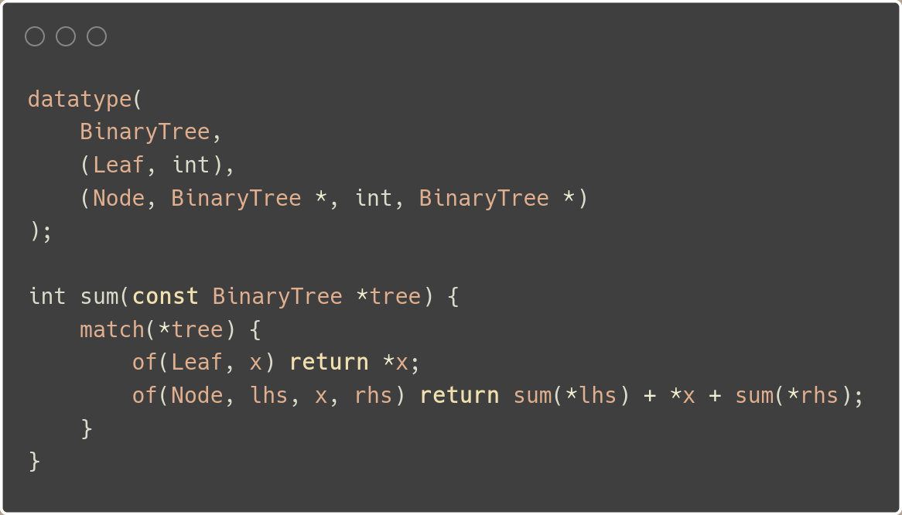
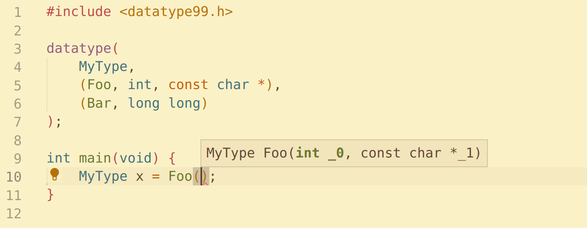

<div align="center">
  
  <h1>Datatype99</h1>
  <a href="https://github.com/Hirrolot/datatype99/actions">
    
  </a>

  Safe, intuitive [algebraic data types] with exhaustive pattern matching & compile-time introspection facilities. No external tools required, pure C99/C++11.
</div>

[algebraic data types]: https://en.wikipedia.org/wiki/Algebraic_data_type

## Highlights

 - **Type-safe.** Normally you cannot access or construct an invalid variant.

 - **Exhaustive pattern matching.** A sane compiler will warn you if not all cases are handled in `match`.

 - **Portable.** Everything you need is a standard-conforming C99/C++11 preprocessor.

 - **Transparent.** Datatype99 comes with formal [code generation semantics], so if you try to look at `datatype`'s output, you will not see something unexpected.

 - **FFI-tolerant.** Because of transparency, writing an FFI is not a challenge.

## Installation

 1. Download Datatype99 and [Metalang99] (minimum supported version -- [1.1.0](https://github.com/Hirrolot/metalang99/releases/tag/v1.1.0)).
 2. Add `datatype99` and `metalang99/include` to your include paths.
 3. `#include <datatype99.h>` beforehand.

**PLEASE**, use Datatype99 only with [`-ftrack-macro-expansion=0`] (GCC) or something similar, otherwise it will throw your compiler to the moon. [Precompiled headers] are also very helpful.

[Metalang99]: https://github.com/Hirrolot/metalang99
[precompiled headers]: https://en.wikipedia.org/wiki/Precompiled_header
[`-ftrack-macro-expansion=0`]: https://gcc.gnu.org/onlinedocs/gcc/Preprocessor-Options.html

## Usage

(The full example: [`examples/binary_tree.c`](examples/binary_tree.c).)

A sum type is created using the `datatype` macro. I guess you have already caught the syntax but actually there exist one more kind of a variant: an empty variant which is expressed simply as `(Foo)`. It holds no data.

Pattern matching is likewise intuitive. Just a few brief notes:

 - To match an empty variant, write `of(Foo) { ... }`.
 - To match the default case, i.e. when all other cases failed, write `otherwise { ... }`.
 - To ignore a variable inside `of`, write `_`: `of(Foo, a, b, _, d)`.

Also, you can introspect your sum types at compile-time; see [`examples/derive/`](examples/derive/) for the examples.

Happy hacking!

## Syntax and semantics

Having a well-defined semantics of the macros, you can write an FFI which is quite common in C.

### EBNF syntax

```ebnf
<datatype>      ::= "datatype(" [ <derive-clause> "," ] <datatype-name> { "," <variant> }+ ")" ;
<record>        ::= "record(" [ <derive-clause> "," ] <record-name> { "," <field> } ")" ;
<datatype-name> ::= <ident> ;
<record-name>   ::= <ident> ;

<variant>       ::= "(" <variant-name> { "," <type> }* ")" ;
<field>         ::= "(" <type> "," <field-name> ")" ;
<variant-name>  ::= <ident> ;
<field-name>    ::= <ident> ;

<derive-clause> ::= "derive(" <deriver-name> { "," <deriver-name> }* ")" ;
<deriver-name>  ::= <ident> ;

<match>         ::= "match(" <lvalue> ")" { <arm> }+ ;
<matches>       ::= "matches(" <expr> "," <ident> ")" ;
<if-let>        ::= "ifLet(" <lvalue> "," <variant-name> "," <ident> { "," <ident> }* ")" <stmt> ;
<of>            ::= "of(" <variant-name> { "," <ident> }* ")" <stmt> ;
<otherwise>     ::= "otherwise" <stmt> ;
```

### Semantics

(It might be helpful to look at the [generated data layout](https://godbolt.org/z/3TKn8T3Gj) of [`examples/binary_tree.c`](examples/binary_tree.c).)

#### `datatype`

 1. Before everything, the following type definition is generated:

```
typedef struct <datatype-name> <datatype-name>;
```

 2. For each non-empty variant, the following type definition is generated (the metavariable `<type>` ranges over a corresponding variant's types):

```
typedef struct <datatype-name><variant-name> {
    <type>0 _0;
    ...
    <type>N _N;
} <datatype-name><variant-name>;
```

 3. For each non-empty variant, the following type definitions to types of each field of `<datatype-name><variant-name>` are generated:

```
typedef <type>0 <variant-name>_0;
...
typedef <type>N <variant-name>_N;
```

 4. For each variant, the following type definition to a corresponding sum type is generated:

```
typedef struct <datatype-name> <variant-name>SumT;
```

 5. For each sum type, the following tagged union is generated (inside the union, only fields to structures of non-empty variants are generated):

```
typedef enum <datatype-name>Tag {
    <variant-name>0Tag, ..., <variant-name>NTag
} <datatype-name>Tag;

typedef union <datatype-name>Variants {
    char dummy;

    <datatype-name><variant-name>0 <variant-name>0;
    ...
    <datatype-name><variant-name>N <variant-name>N;
} <datatype-name>Variants;

struct <datatype-name> {
    <datatype-name>Tag tag;
    <datatype-name>Variants data;
};
```

<details>
  <summary>Note on char dummy;</summary>

  (`char dummy;` is needed to make the union contain at least one item, according to the standard, even if all variants are empty. Such a `datatype` would enforce strict type checking unlike plain C `enum`s.)
</details>

 6. For each variant, the following function called a _value constructor_ is generated:

```
inline static <datatype-name> <variant-name>(...) { /* ... */ }
```

 7. Now, when a sum type is fully generated, the derivation process takes place. Each deriver is invoked sequentially, from left to right, as

```
ML99_call(DATATYPE99_DERIVE_##<deriver-name>, v(<datatype-name>), variants...)
```

where
 - `variants...` is a [list] of variants represented as two-place [tuples]: `(<variant-name>, types...)`, where
   - `types...` is a [list] of types of the corresponding variant.

Put simply, a deriver is a [Metalang99-compliant](https://metalang99.readthedocs.io/en/latest/#definitions) macro which is meant to automatically generate something global for a sum type, like interface implementations or almost any other stuff. If you are acquainted with Rust, Datatype99's derive macros are conceptually the same as the [derive attribute]. From my experience, derive macros allow for really nice, declarative, type-safe APIs.

[list]: https://metalang99.readthedocs.io/en/latest/list.html
[tuples]: https://metalang99.readthedocs.io/en/latest/tuple.html
[derive attribute]: https://doc.rust-lang.org/reference/attributes/derive.html

#### `record`

`record` represents a _record type_: it is simply a `struct` for which the derivation process is defined.

 1. The following structure is generated:

```
typedef struct <record-name> {
    <type>0 <field-name>0;
    ...
    <type>N <field-name>N;
} <record-name>;
```

 2. Each deriver is invoked sequentially, from left to right, as

```
ML99_call(DATATYPE99_RECORD_DERIVE_##<deriver-name>, v(<record-name>), fields...)
```

where
 - `fields...` is a [list] of fields represented as two-place [tuples]: `(<type>, <field-name>)`.

#### `match`

`match` has the expected semantics: it sequentially tries to match the given instance of a sum type against the given variants, and, if a match has succeeded, it executes the corresponding statement and moves down to the next instruction (`match(val) { ... } next-instruction;`). If all the matches have failed, it executes the statement after `otherwise` and moves down to the next instruction.

A complete `match` construct results in a single C statement.

#### `of`

`of` accepts a matched variant name as a first argument and the rest of arguments comprise a comma-separated list of bindings.

 - A binding equal to `_` is ignored.
 - A binding **not** equal to `_` stands for a pointer to a corresponding data of the variant (e.g., let there be `(Foo, T1, T2)` and `of(Foo, x, y)`, then `x` has the type `T1 *` and `y` is `T2 *`).

There can be more than one `_` binding, however, non-`_` bindings must be distinct.

To match an empty variant, write `of(Bar)`.

#### `matches`

`matches` just tests an instance of a sum type for a given variant. If the given instance corresponds to the given variant, it expands to truthfulness, otherwise it expands to falsehood.

#### `ifLet`

`ifLet` tries to match the given instance of a sum type against the given variant, and, if a match has succeeded, it executes the corresponding statement.

Think of `ifLet(<expr>, <variant-name>, vars...) { /* ... */ }` as of an abbreviation of

```
match(<expr>) {
    of(<variant-name>, vars...) { /* ... */ }
    otherwise {}
}
```

A complete `ifLet` construct results in a single C statement.

### Unit type

The unit type `UnitT` represents a type of a single value, `unit_v` (it should not be assigned to anything else). `UnitT` and `unit_v` are defined as follows:

```c
typedef char UnitT;
static const UnitT unit_v = '\0';
```

### Derive helper attributes

You can pass named arguments to a deriver; these are called _derive helper attributes_. They must be specified as object-like macros of the form:

```
#define <variant-name>_<namespace>_<attribute-name> attr(/* attribute value */)
```

where `<namespace>` is either `<datatype-name>`/`<record-name>` or `<variant-name>`/`<field-name>` for `datatype`/`record`-specific and variant/field-specific attributes, respectively.

To manipulate derive helper attributes, there are a few predefined macros:

 - `DATATYPE99_attrIsPresent`/`DATATYPE99_ATTR_IS_PRESENT`

    Accepts an attribute name and checks if it is present or not. It can be used to check the presence of an optional attribute.

 - `DATATYPE99_attrValue`/`DATATYPE99_ATTR_VALUE`

    Accepts an attribute name extracts its value. A provided attribute **must** be present.

 - `DATATYPE99_assertAttrIsPresent`

    Accepts an attribute name and emits a fatal error if the attribute is not present, otherwise results in emptiness. It can be used for mandatory attributes.

(The naming convention here is the same [as of Metalang99](https://metalang99.readthedocs.io/en/latest/#naming-conventions).)

### Miscellaneous

 - The macros `DATATYPE99_MAJOR`, `DATATYPE99_MINOR`, and `DATATYPE99_PATCH` stand for the corresponding components of a version of Datatype99.

 - If you do **not** want the shortened versions to appear (e.g. `match` without the prefix `99`), define `DATATYPE99_NO_ALIASES` before `#include <datatype99.h>`.

 - For each macro using `ML99_EVAL`, Datatype99 provides its [Metalang99-compliant](https://metalang99.readthedocs.io/en/latest/#definitions) counterpart which can be used inside derivers and other Metalang99-compliant macros:

| Macro | Metalang99-compliant counterpart |
|----------|----------|
| `datatype` | `DATATYPE99_datatype` |
| `record` | `DATATYPE99_record` |
| `of` | `DATATYPE99_of` |
| `ifLet` | `DATATYPE99_ifLet` |

 - There is a built-in deriver `dummy` which generates nothing. It is defined both for record and sum types.

 - [Arity specifiers] and [desugaring macros] are provided for each public Metalang99-compliant macro exposed by Datatype99.

[Arity specifiers]: https://hirrolot.gitbook.io/metalang99/partial-application
[desugaring macros]: https://metalang99.readthedocs.io/en/latest/#definitions

## Guidelines

 - If you use [Clang-Format], cancel formatting for a `datatype` definition using `// clang-format off` & `// clang-format on` to make it look prettier.
 - Always `#undef` derive helper attributes after a corresponding `datatype` definition not to pollute your namespace.

[Clang-Format]: https://clang.llvm.org/docs/ClangFormatStyleOptions.html

## Pitfalls

 - Do **not** use `break`/`continue` inside statements provided to `of` and `ifLet`; use `goto` labels instead.
 - To specify an array as a variant parameter, you must put it into a separate `struct`; see [`examples/array_in_variant.c`](examples/array_in_variant.c).
 - Bindings introduced by `of` are **always** mutable, so make sure you do **not** mutate them if the value passed to `match` is qualified as `const`.

## Credits

Thanks to Rust and ML for their implementations of sum types.

## Learning resources

 - [_Unleashing Sum Types in Pure C99_](https://medium.com/@hirrolot/unleashing-sum-types-in-pure-c99-31544302d2ba) by Hirrolot
 - [_Compile-Time Introspection of Sum Types in Pure C99_](https://hirrolot.medium.com/compile-time-introspection-of-sum-types-in-pure-c99-ffa523b60385) by Hirrolot
 - [_Comparing algebraic data types: Rust and Datatype99_](https://www.reddit.com/r/ProgrammingLanguages/comments/nc1o18/comparing_algebraic_data_types_rust_and_datatype99/) by Hirrolot

## FAQ

### Q: Why use C instead of Rust/Zig/whatever else?

A:

 - Datatype99 can be integrated into existing code bases written in pure C.
 - Sometimes C is the only choice:
   - Some resource-constrained systems do not allow for a higher level programming language.
   - Some embedded devices only have C backend.

### Q: Why not third-party code generators?

A: See [Metalang99's README >>](https://github.com/Hirrolot/metalang99#q-why-not-third-party-code-generators).

### Q: How does it work?

A: The `datatype` macro generates a tagged union accompanied with type hints and value constructors. Pattern matching desugars merely to a switch statement. To generate all this stuff, [Metalang99] is used, which is a preprocessor metaprogramming library.

### Q: What about compile-time errors?

A: Some kinds of syntactic errors are detected by the library itself (`-E` flag):

```c
// !"Metalang99 error" (ML99_assertIsTuple): "Bar(int) must be (x1, ..., xN)"
datatype(A, (Foo, int), Bar(int));
```

The others are understandable as well:

```c
datatype(Foo, (FooA, NonExistingType));
```

```
playground.c:3:1: error: unknown type name ‘NonExistingType’
    3 | datatype(
      | ^~~~~~~~
playground.c:3:1: error: unknown type name ‘NonExistingType’
playground.c:3:1: error: unknown type name ‘NonExistingType’
```

If an error is not comprehensible at all, try to look at generated code (`-E`). Hopefully, the [code generation semantics] is formally defined so normally you will not see something unexpected.

[code generation semantics]: #semantics

### Q: What about IDE support?



VS Code automatically enables suggestions of generated types but, of course, it does not support macro syntax highlightment.

### Q: What compilers are tested?

A: Datatype99 is known to work on these compilers:

 - GCC
 - Clang
 - MSVC
 - TCC

## Troubleshooting

### `warning: control reaches end of non-void function [-Wreturn-type]`

This is a known false positive occurring when `match` is used to return control back to a caller. Unfortunately, we cannot fix it in the library itself, but there are two workarounds:

 1. Disable this warning explicitly. With [GCC diagnostic pragmas] (or the [Clang's counterpart](https://clang.llvm.org/docs/UsersManual.html#controlling-diagnostics-via-pragmas)):

```c
#pragma GCC diagnostic push
#pragma GCC diagnostic ignored "-Wreturn-type"
int foo(void) {
    match(x) {
        of(Foo, foo) return X;
        of(Bar, bar) return Y;
    }
}
#pragma GCC diagnostic pop
```

[GCC diagnostic pragmas]: https://gcc.gnu.org/onlinedocs/gcc/Diagnostic-Pragmas.html

 2. Assign a result variable inside branches and return it after `match`:

```c
int foo(void) {
    int result = 0;

    match(x) {
        of(Foo, foo) result = X;
        of(Bar, bar) result = Y;
    }

    return result;
}
```

See [issue 9](https://github.com/Hirrolot/datatype99/issues/9).
